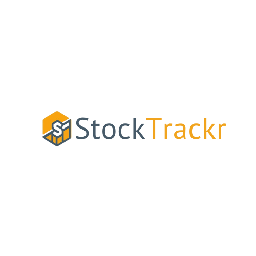

# Welcome to StockTrackr

StockTrackr is an inventory management system equipped with all the tools necessary for keeping track of your
inventory, orders, and transactions. With a simple, easy to use interface, StockTrackr is ideal for smaller teams
to help them manage their time and money effectively. The best part? It's totally free.

Instructions:
1) After downloading, open a terminal and navigate to the downloaded folder.
2) Run "npm install" to install the dependencies.
3) Create a .env file in the project root folder to allow the dbConfig.js to connect to the database / Express server.
   (We used a GCP VM with the shared database so the external IP changed often).
5) Run "npm start" in the terminal to start the web app.
6) Go to the URL output by "npm start" (ex: http://localhost:5001) to view the application.

This project is the TCSS 445 - Database Systems Design final project, created by Arafa Mohamed, Evin Roen, 
and Natan Artemiev.
